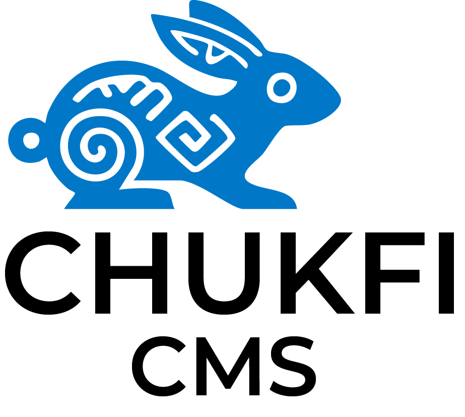

<div align="center">
  
  
  # Chukfi CMS
  
  **Chukfi** (chook-fee) is the Choctaw word for **rabbit**, a symbol of speed, agility, and quick thinking.<br>
  Chukfi CMS embraces those qualities by providing a fast, modern, open-source CMS built with<br>
  **Astro**, **React**, and **Go**.
</div>

<div align="center">

[](https://github.com/Native-Consulting-Services/chukfi-cms/releases)
[](https://github.com/Native-Consulting-Services/chukfi-cms/actions/workflows/ci.yml)
[](https://opensource.org/licenses/MIT)
[](https://github.com/Native-Consulting-Services/chukfi-cms/generate)
[](https://github.com/Native-Consulting-Services/chukfi-cms/graphs/contributors)

</div>

> **🚀 Template Repository**: Use this template to create your own CMS! Click "Use this template" above to get started.

> **✅ Ready for Development**: Chukfi CMS is fully functional with zero external dependencies. Complete project structure, authentication, database schema, and admin UI are ready. **5-minute setup** from clone to running!

An open-source, self-hosted content management system built as a monorepo with Astro frontend and Go backend.

## ✨ Key Features

- ⚡ **Fast Go backend** with Pure SQLite (no CGO dependencies)
- 🐇 **Agile Astro + React** admin dashboard with hot reload
- 🛡️ **Role-based access control** with granular permissions
- 📚 **Collection-based schema** system (Payload CMS style)
- 📦 **Media uploads** and library management
- 🌱 **Open-source** and community-driven
- 🚀 **Zero external dependencies** - works immediately after clone

## 📸 Screenshots

<div align="center">
  
  *Screenshots coming soon - Admin dashboard, collection management, and media library interfaces*
  
</div>

## 🚀 Quick Start

### Prerequisites

- **Node.js 18+** and **Go 1.21+**

### 5-Minute Setup

```bash
# Use this template or clone directly
git clone https://github.com/Native-Consulting-Services/chukfi-cms.git
cd chukfi-cms

# Install dependencies
cd frontend && npm install && cd ..
cd backend && go mod tidy && cd ..

# Initialize database and start servers
cd backend && go run cmd/migrate/main.go up && cd ..

# Option A: VS Code (Recommended)
# Ctrl+Shift+P → "Tasks: Run Task" → "Start Development Environment"

# Option B: Manual (two terminals)
cd frontend && npm run dev     # Terminal 1
cd backend && go run cmd/server/main.go  # Terminal 2
```

### Verify Installation

- **Frontend**: http://localhost:4321 ✅
- **Admin Dashboard**: http://localhost:4321/admin ✅
- **Backend API**: http://localhost:8080/health ✅
- **Default Login**: admin@chukfi.com / admin123 ✅

## 📖 Documentation

### **Getting Started**

- 🚀 **[Installation Guide](docs/INSTALLATION.md)** - Detailed setup instructions
- 🎯 **[Quick Start Tutorial](docs/QUICK_START.md)** - Your first collection in 10 minutes
- 🛠️ **[Development Guide](DEVELOPMENT.md)** - Local development workflow

### **Complete Documentation**

- 📚 **[Documentation Hub](docs/README.md)** - All guides and references
- 🏗️ **[Collections Guide](docs/guides/COLLECTIONS.md)** - Content management
- 👥 **[Users & Permissions](docs/guides/USERS_PERMISSIONS.md)** - Access control
- 🔌 **[REST API Reference](docs/api/REST_API.md)** - Complete API docs

## 🏗️ Architecture

```
chukfi-cms/
├── frontend/              # Astro + React admin dashboard
├── backend/               # Go HTTP API with Pure SQLite
├── shared/                # TypeScript type definitions
├── docs/                  # 📖 Complete documentation
└── assets/                # 🎨 Branding and media assets
```

**Tech Stack**: Astro, React, Tailwind CSS, Go, chi router, Pure SQLite, JWT

## 🤝 Contributing

We welcome contributions! See our [Contributing Guide](CONTRIBUTING.md) for details.

**Quick Contributing Steps**:

1. Fork the repository
2. Create a feature branch: `git checkout -b feature/amazing-feature`
3. Make your changes and add tests
4. Submit a pull request

## 📦 Releases & Roadmap

- **📋 [Latest Release](https://github.com/Native-Consulting-Services/chukfi-cms/releases)** - Download pre-built binaries
- **🗺️ [Roadmap](docs/ROADMAP.md)** - Planned features and timeline
- **📝 [Changelog](CHANGELOG.md)** - Release history and changes

## 💬 Community & Support

- 💡 **[GitHub Discussions](https://github.com/Native-Consulting-Services/chukfi-cms/discussions)** - Q&A and announcements
- 🐛 **[Issues](https://github.com/Native-Consulting-Services/chukfi-cms/issues)** - Bug reports and feature requests
- 🔒 **[Security Policy](SECURITY.md)** - Report security vulnerabilities

## 📄 License

This project is licensed under the MIT License - see the [LICENSE](LICENSE) file for details.

---

<div align="center">

**Built with ❤️ by the Chukfi CMS community**

⭐ **Star this repository** if you find it useful!

</div>
